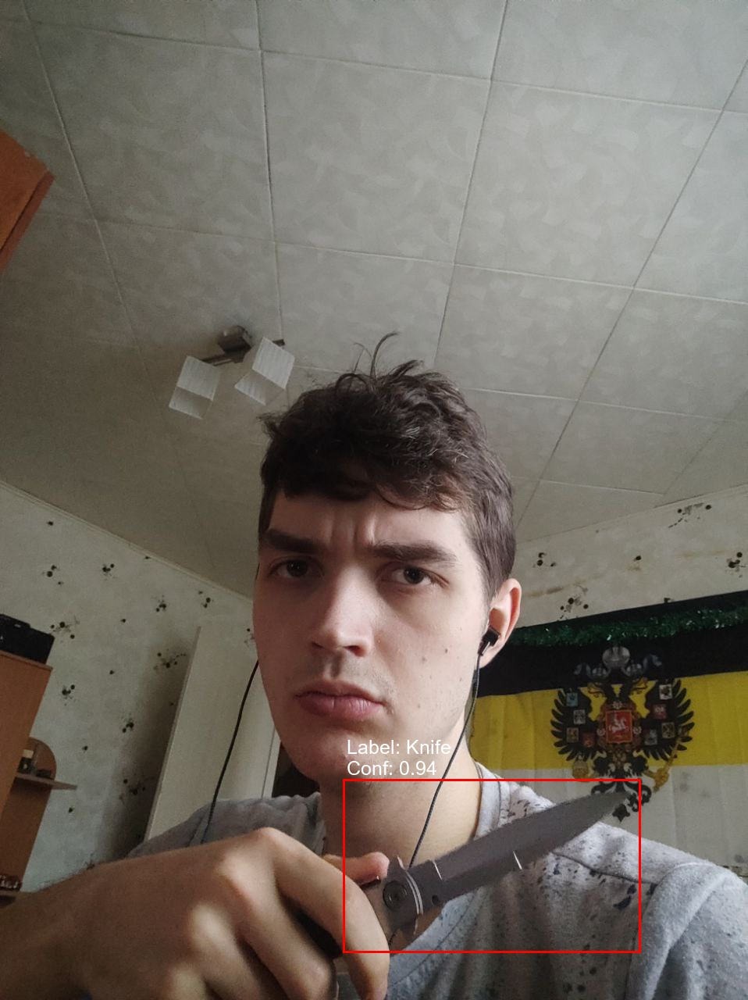
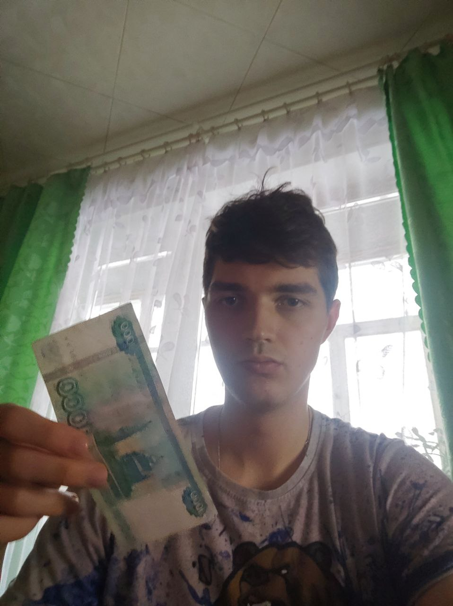

# Detection-of-dangerous-weapons-in-the-hands
Detection of dangerous weapons in the hands using detecto and streamlit

В чём суть репозитория?
------------------------------------
Это финальный проект курса по глубинному обучению Deep Learning School. Моя цель заключалась в том, чтобы обучить уже готовую модель на выбранном мной датасете и сделать Web-demo.

В качестве основного фремйворка для работы с моделью была выбрана библиотека `Detecto`, которая была написана при помощи `PyTorch`, из-за чего если мне не понравится какой-то класс или функция, то я смог бы спокойно их переписать, что я и делал.

В репозитории есть `train.ipynb` файл, который является основным, так как именно в нем была написана модель, датасет, функция измерения метрики MaP, обучена модель и выведены результаты.

Файлы типа `.py` созданы для запуска Web-demo.
Для его запуска локально в коммандной строке нужно ввести 

`streamlit run Web.py`.

А так он был загржуен на платформу `Streamlit Cloud` и по этой [ссылке](https://tiltovskii-detection-of-dangerous-weapons-in-the-han-web-lzra5c.streamlit.app/) должен работать удаленно.

Датасет
------------------------------------
Датасет был взят из этого [репозитория](https://github.com/ari-dasci/OD-WeaponDetection) на GitHub. В целом мне понравился датасет тем, что, к примеру, если обучить на нем модель и поставить её на камеры в магазинчике, то можно с большим шансом предотвратить ограбление, если такое имело место быть.

В нем всего 6 классов: нож, банкнота, кредитная карточка, телефон, пистолет и кошелек. Как раз датасет может пригодиться в примере, который я привел выше.

Модель
------------------------------------
В качестве модели был взят Faster R-CNN c ResNet-50 внутри. Сначала был выбор брать какой-нибудь Mobile-Net, чтоб быстрее детекция работала, но результаты такой модели мне не нравились.

Результаты
------------------------------------
Результаты я покажу на своих фотографиях, где я с ножом и тысячной купюрой.

  
  

  
  

Интересно, что если запускать модель на последней фотографии локально, то будет только бокс "купюры", а удаленно он еще дает бокс с уверенностью 0.06 "ножа".

В итоге я добился Fine-tune модели до метрики `Map = 0.68` и деплоя это в Web, чего и требовалось от проекта.

Источники
------------------------------------
Датасет:  
https://github.com/ari-dasci/OD-WeaponDetection  

Streamlit: 
https://streamlit.io/  
https://habr.com/ru/post/664076/  
https://medium.com/nuances-of-programming/как-развернуть-веб-приложение-streamlit-в-сети-три-простых-способа-3fe4bdbbd0a9   

Detecto:  
https://github.com/alankbi/detecto  
https://medium.com/pytorch/detecto-build-and-train-object-detection-models-with-pytorch-5f31b68a8109  
